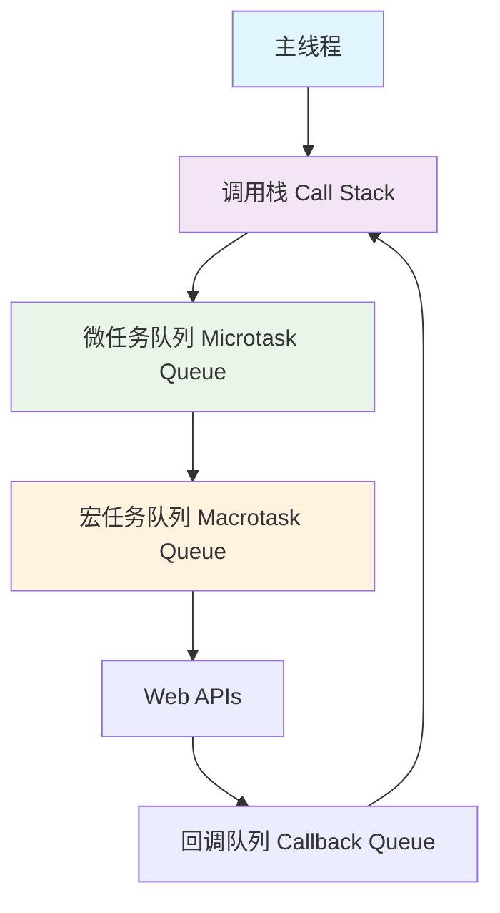
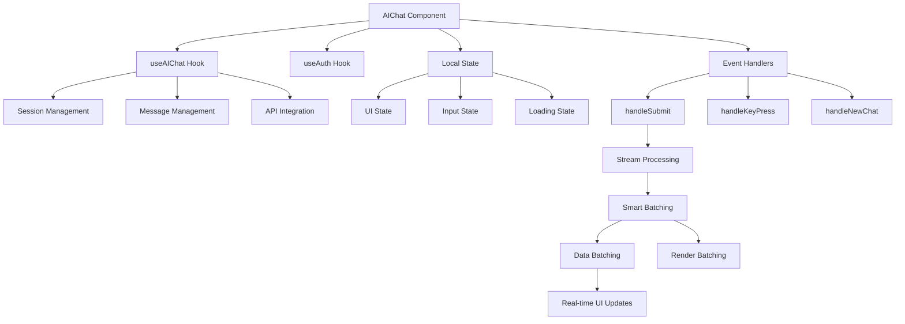
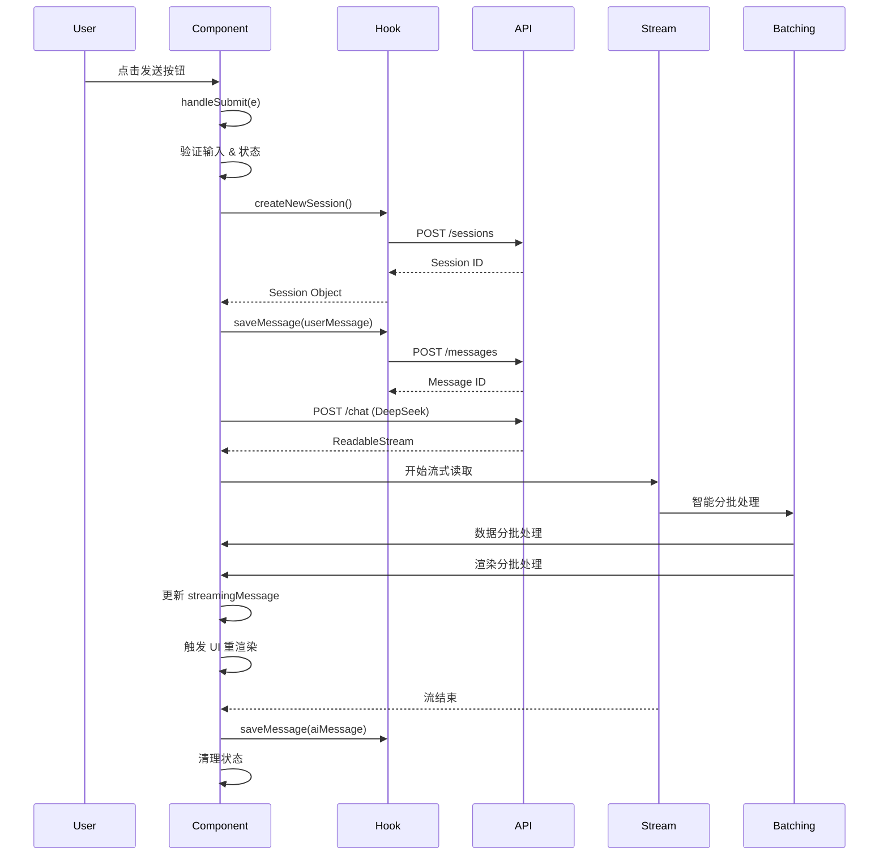
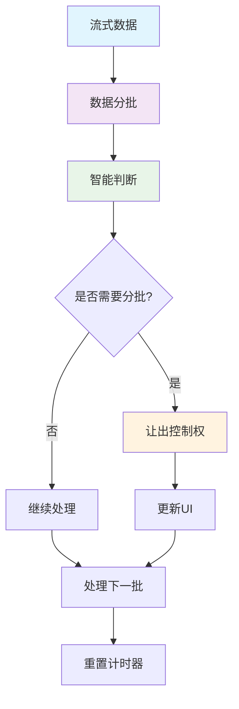
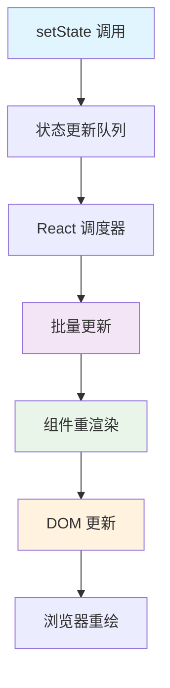

# AIChat 组件事件循环深度解析

## 📋 目录
- [1. 概述](#1-概述)
- [2. JavaScript 事件循环基础](#2-javascript-事件循环基础)
- [3. AIChat 组件架构分析](#3-aichat-组件架构分析)
- [4. 核心事件循环流程](#4-核心事件循环流程)
- [5. 流式响应处理机制](#5-流式响应处理机制)
- [6. 智能分批处理机制](#6-智能分批处理机制)
- [7. React 状态更新循环](#7-react-状态更新循环)
- [8. 性能优化策略](#8-性能优化策略)
- [9. 面试要点总结](#9-面试要点总结)

---

## 1. 概述

### 1.1 项目背景
这是一个基于 Next.js + TypeScript 的 AI 聊天组件，实现了：
- **SSG + ISR** 静态生成
- **流式响应** 实时对话
- **智能分批处理** 防止UI阻塞
- **会话管理** 多轮对话
- **Markdown 渲染** 富文本展示

### 1.2 技术栈
```
Frontend: React 18 + TypeScript + Next.js
UI: Framer Motion + SCSS
API: DeepSeek API (流式响应)
状态管理: React Hooks + Redux
性能优化: 智能分批 + 让出控制权
```

### 1.3 核心挑战
- 如何处理复杂的异步事件流？
- 如何实现实时流式响应？
- 如何防止大量数据处理时UI阻塞？
- 如何管理多层状态同步？
- 如何优化性能和用户体验？

---

## 2. JavaScript 事件循环基础

### 2.1 事件循环模型



### 2.2 执行优先级
```
1. 同步代码 (Call Stack)
2. 微任务 (Microtask Queue)
   - Promise.then/catch/finally
   - async/await
   - queueMicrotask()
3. 宏任务 (Macrotask Queue)
   - setTimeout/setInterval
   - setImmediate
   - requestAnimationFrame
   - I/O 操作
```

### 2.3 关键概念
- **Event Loop**: 持续检查调用栈是否为空
- **Call Stack**: 存储当前执行的函数调用
- **Task Queue**: 存储待执行的回调函数
- **Microtask**: 优先级高于宏任务，在下一个宏任务前执行

---

## 3. AIChat 组件架构分析

### 3.1 组件结构图



### 3.2 状态管理架构

```typescript
// 核心状态结构
interface AIChatState {
  // Hook 状态 (持久化)
  sessions: Session[];
  currentSession: Session | null;
  messages: Message[];
  
  // 本地状态 (临时)
  input: string;
  isLoading: boolean;
  streamingMessage: string;
  error: string | null;
  
  // 分批处理状态
  processedCount: number;
  startTime: number;
}
```

---

## 4. 核心事件循环流程

### 4.1 用户交互事件循环



### 4.2 代码实现分析

```typescript
const handleSubmit = async (e: React.FormEvent) => {
    e.preventDefault(); // 1. 阻止默认行为
    
    if (!input.trim() || isLoading) return; // 2. 状态检查
    
    // 3. 创建会话 (微任务1)
    if (!currentSession) {
        const newSession = await createNewSession();
        if (!newSession) {
            setError('创建会话失败');
            return;
        }
    }
    
    // 4. 构造用户消息
    const userMessage: Message = {
        id: Date.now().toString(),
        content: input.trim(),
        type: 'user',
        timestamp: new Date(),
    };
    
    // 5. 保存用户消息 (微任务2)
    try {
        await saveMessage(userMessage);
    } catch (err) {
        console.error('保存用户消息失败:', err);
    }
    
    // 6. 更新本地状态
    setMessages(prev => [...prev, userMessage]);
    setInput('');
    setIsLoading(true);
    setError(null);
    setStreamingMessage('');
    
    // 7. 调用 AI API (微任务3)
    const response = await fetch(apiEndpoint, {
        method: 'POST',
        headers: {
            'Content-Type': 'application/json',
            'Authorization': `Bearer ${apiKey}`
        },
        body: JSON.stringify(responseBody)
    });
    
    // 8. 开始智能分批流式处理 (微任务4+)
    const reader = response.body?.getReader();
    const decoder = new TextDecoder();
    let buffer = '';
    let finalContent = '';
    let processedCount = 0;
    let startTime = performance.now();
    
    while (true) {
        const { done, value } = await reader.read(); // 微任务循环
        if (done) break;
        
        // 智能分批处理流数据...
        buffer += decoder.decode(value, { stream: true });
        const lines = buffer.split('\n');
        buffer = lines.pop() || '';
        
        // 数据分批处理
        const DATA_BATCH_SIZE = 50;
        for (let i = 0; i < lines.length; i += DATA_BATCH_SIZE) {
            const dataBatch = lines.slice(i, i + DATA_BATCH_SIZE);
            
            // 处理这一批数据
            for (const line of dataBatch) {
                const parsed = currentModel.parseStream(line);
                if (parsed?.content) {
                    finalContent += parsed.content;
                    processedCount++;
                }
            }
            
            // 智能分批判断
            if (shouldBatch(lines.length, processedCount, startTime)) {
                setStreamingMessage(finalContent);
                await new Promise(resolve => setTimeout(resolve, 0));
                startTime = performance.now();
            }
        }
    }
};
```

### 4.3 事件循环时序分析

```
时间轴: 0ms → 10ms → 50ms → 100ms → 500ms → 1000ms
        ↓     ↓     ↓     ↓     ↓     ↓
事件:   点击   验证   创建   保存   调用   智能分批
       发送   输入   会话   消息   API   流处理
       
微任务队列:
[验证输入] → [创建会话] → [保存消息] → [API调用] → [分批处理1] → [分批处理2] → ...
```

---

## 5. 流式响应处理机制

### 5.1 流式处理架构

```mermaid
graph LR
    A[DeepSeek API] --> B[ReadableStream]
    B --> C[TextDecoder]
    C --> D[Buffer Processing]
    D --> E[Data Batching]
    E --> F[Smart Batching]
    F --> G[Render Batching]
    G --> H[UI Update]
    H --> I[React Re-render]
    
    style A fill:#ffebee
    style B fill:#e3f2fd
    style E fill:#e8f5e8
    style F fill:#fff3e0
    style G fill:#f3e5f5
    style H fill:#e1f5fe
```



### 5.2 核心流处理代码

```typescript
// 智能分批流式响应处理的核心逻辑
const reader = response.body?.getReader();
const decoder = new TextDecoder();
let buffer = '';
let finalContent = '';
let processedCount = 0;
let startTime = performance.now();

while (true) {
    // 每次循环都是一个微任务
    const { done, value: contentValue } = await reader.read();
    
    if (done) {
        // 流结束，保存最终消息
        const finalMessage: Message = {
            id: (Date.now() + 1).toString(),
            content: finalContent,
            type: 'ai',
            timestamp: new Date(),
        };
        
        await saveMessage(finalMessage);
        setMessages(prev => [...prev, finalMessage]);
        setStreamingMessage('');
        break;
    }
    
    // 解码二进制数据
    buffer += decoder.decode(contentValue, { stream: true });
    const lines = buffer.split('\n');
    buffer = lines.pop() || '';
    
    // 智能分批处理每一行数据
    const DATA_BATCH_SIZE = 50;
    for (let i = 0; i < lines.length; i += DATA_BATCH_SIZE) {
        const dataBatch = lines.slice(i, i + DATA_BATCH_SIZE);
        
        // 处理这一批数据
        for (const line of dataBatch) {
            const parsed = currentModel.parseStream(line);
            if (parsed?.content) {
                finalContent += parsed.content;
                processedCount++;
            }
        }
        
        // 智能分批判断
        if (shouldBatch(lines.length, processedCount, startTime)) {
            setStreamingMessage(finalContent);
            await new Promise(resolve => setTimeout(resolve, 0));
            startTime = performance.now();
        }
    }
}
```

### 5.3 流式处理的事件循环特点

```typescript
// 特点1: 异步迭代器模式 + 智能分批
while (true) {
    const { done, value } = await reader.read();
    // 每次 await 都会产生一个微任务
    
    // 数据分批处理
    for (let i = 0; i < lines.length; i += DATA_BATCH_SIZE) {
        // 处理一批数据
        // 智能判断是否需要让出控制权
    }
}

// 特点2: 实时状态更新 + 分批渲染
setStreamingMessage(finalContent);
// 每次调用都会触发 React 状态更新循环，但通过分批减少频率

// 特点3: 错误边界处理 + 性能优化
try {
    const parsed = JSON.parse(data);
} catch (e) {
    console.error('Error parsing stream data:', e);
    // 错误不会中断流处理
}
```

---

## 6. 智能分批处理机制

### 6.1 分批处理架构



### 6.2 智能分批策略

```typescript
// 智能分批判断函数
const shouldBatch = (totalLines: number, processedCount: number, startTime: number) => {
    // 条件1：数据量大
    if (totalLines > 100) return true;
    
    // 条件2：处理时间长
    const currentTime = performance.now();
    if (currentTime - startTime > 16) return true;
    
    // 条件3：处理数量多
    return processedCount > 200;
};

// 数据分批处理
const DATA_BATCH_SIZE = 50;
for (let i = 0; i < lines.length; i += DATA_BATCH_SIZE) {
    const dataBatch = lines.slice(i, i + DATA_BATCH_SIZE);
    
    // 处理这一批数据
    for (const line of dataBatch) {
        const parsed = currentModel.parseStream(line);
        if (parsed?.content) {
            finalContent += parsed.content;
            processedCount++;
        }
    }
    
    // 智能分批判断
    if (shouldBatch(lines.length, processedCount, startTime)) {
        setStreamingMessage(finalContent);
        await new Promise(resolve => setTimeout(resolve, 0));
        startTime = performance.now();
    }
}
```

### 6.3 双重分批优化

```typescript
// 双重分批：数据分批 + 渲染分批
const DATA_BATCH_SIZE = 50;  // 数据分批大小
const RENDER_BATCH_SIZE = 10; // 渲染分批大小

for (let i = 0; i < lines.length; i += DATA_BATCH_SIZE) {
    // 数据分批：处理一批数据
    const dataBatch = lines.slice(i, i + DATA_BATCH_SIZE);
    
    for (let j = 0; j < dataBatch.length; j++) {
        const line = dataBatch[j];
        const parsed = currentModel.parseStream(line);
        
        if (parsed?.content) {
            finalContent += parsed.content;
            processedCount++;
            
            // 渲染分批：每处理一定数量就更新UI
            if (processedCount % RENDER_BATCH_SIZE === 0) {
                setStreamingMessage(finalContent);
                await new Promise(resolve => setTimeout(resolve, 0));
            }
        }
    }
    
    // 数据分批完成，让出控制权
    await new Promise(resolve => setTimeout(resolve, 0));
}
```

### 6.4 分批处理的事件循环特点

```typescript
// 特点1: 数据分批防止长时间阻塞
for (let i = 0; i < lines.length; i += DATA_BATCH_SIZE) {
    // 每次只处理DATA_BATCH_SIZE行数据
    // 防止长时间占用主线程
}

// 特点2: 智能判断动态调整
if (shouldBatch(lines.length, processedCount, startTime)) {
    // 根据数据量、时间、数量动态决定是否分批
}

// 特点3: 让出控制权保证UI响应
await new Promise(resolve => setTimeout(resolve, 0));
// 让浏览器有时间渲染UI和处理用户交互
```

---

## 7. React 状态更新循环

### 7.1 React 状态更新机制



### 7.2 状态同步机制

```typescript
// Hook 状态与本地状态同步
useEffect(() => {
    if (hookMessages.length > 0) {
        setMessages(hookMessages); // 触发本地状态更新
    } else {
        setMessages([]);
    }
}, [hookMessages]); // 依赖数组触发重新执行

// 错误状态同步
useEffect(() => {
    if (apiError) {
        setError(apiError); // 同步 API 错误到本地状态
    }
}, [apiError]);
```

### 7.3 状态更新优化

```typescript
// 批量状态更新
const handleSubmit = async (e: React.FormEvent) => {
    // 一次性更新多个状态，减少重渲染
    setMessages(prev => [...prev, userMessage]);
    setInput('');
    setIsLoading(true);
    setError(null);
    setStreamingMessage('');
};

// 函数式更新避免闭包陷阱
setMessages(prev => [...prev, finalMessage]);

// 分批更新减少渲染压力
if (shouldBatch(lines.length, processedCount, startTime)) {
    setStreamingMessage(finalContent);
    // 只在需要时更新UI
}
```

---

## 8. 性能优化策略

### 8.1 事件循环优化

```typescript
// 1. 智能分批处理
const shouldBatch = (totalLines, processedCount, startTime) => {
    if (totalLines > 100) return true;
    if (performance.now() - startTime > 16) return true;
    return processedCount > 200;
};

// 2. 数据分批处理
const DATA_BATCH_SIZE = 50;
for (let i = 0; i < lines.length; i += DATA_BATCH_SIZE) {
    const dataBatch = lines.slice(i, i + DATA_BATCH_SIZE);
    // 处理一批数据
    if (shouldBatch(...)) {
        await new Promise(resolve => setTimeout(resolve, 0));
    }
}

// 3. 条件渲染
{isLoading && !streamingMessage && (
    <div className={styles.loadingDots}>
        {/* 只在需要时渲染 loading */}
    </div>
)}

// 4. 清理函数
useEffect(() => {
    const observer = new IntersectionObserver(/* ... */);
    return () => observer.disconnect(); // 防止内存泄漏
}, []);
```

### 8.2 内存管理

```typescript
// 1. 及时清理流资源
const reader = response.body?.getReader();
try {
    // 流处理逻辑
} finally {
    reader?.releaseLock(); // 释放流锁
}

// 2. 组件卸载时清理
useEffect(() => {
    return () => {
        // 清理定时器、事件监听器等
    };
}, []);

// 3. 分批处理减少内存压力
const dataBatch = lines.slice(i, i + DATA_BATCH_SIZE);
// 每次只处理部分数据，避免大量数据占用内存
```

### 8.3 错误边界处理

```typescript
// 多层错误处理
try {
    await saveMessage(userMessage);
} catch (err) {
    console.error('保存用户消息失败:', err);
    // 继续执行，不阻塞主流程
}

try {
    const parsed = JSON.parse(data);
} catch (e) {
    console.error('Error parsing stream data:', e);
    // 解析错误不影响流处理
}

// 分批处理中的错误处理
for (const line of dataBatch) {
    try {
        const parsed = currentModel.parseStream(line);
        // 处理逻辑...
    } catch (err) {
        console.error('处理数据行失败:', err);
        // 单行错误不影响整批处理
    }
}
```

### 8.4 智能分批优化

```typescript
// 动态批次大小
const getBatchSize = (totalLines: number) => {
    if (totalLines <= 50) return Infinity;  // 不分批
    if (totalLines <= 200) return 100;      // 大批次
    return 50; // 小批次
};

// 性能监控
const startTime = performance.now();
if (shouldBatch(lines.length, processedCount, startTime)) {
    const processTime = performance.now() - startTime;
    console.log(`处理 ${processedCount} 行，耗时 ${processTime}ms`);
}
```

---

## 9. 面试要点总结

### 9.1 核心技术点

| 技术点 | 重要性 | 掌握程度要求 |
|--------|--------|--------------|
| JavaScript 事件循环 | ⭐⭐⭐⭐⭐ | 深入理解 |
| async/await 机制 | ⭐⭐⭐⭐⭐ | 熟练应用 |
| React 状态管理 | ⭐⭐⭐⭐ | 熟练掌握 |
| 流式数据处理 | ⭐⭐⭐⭐⭐ | 重点掌握 |
| 智能分批处理 | ⭐⭐⭐⭐⭐ | 重点掌握 |
| 错误处理机制 | ⭐⭐⭐⭐ | 全面了解 |
| 性能优化策略 | ⭐⭐⭐⭐ | 实践应用 |

### 9.2 面试高频问题

#### Q1: 如何理解 JavaScript 事件循环？
**A:** 事件循环是 JavaScript 处理异步操作的核心机制，包含：
- 调用栈 (Call Stack)
- 微任务队列 (Microtask Queue)  
- 宏任务队列 (Macrotask Queue)
- Web APIs 和回调队列

#### Q2: async/await 在事件循环中的作用？
**A:** async/await 是 Promise 的语法糖：
- async 函数返回 Promise
- await 暂停函数执行，等待 Promise 解决
- 在微任务队列中处理

#### Q3: 如何处理流式响应？
**A:** 使用 ReadableStream API + 智能分批：
```typescript
const reader = response.body?.getReader();
while (true) {
    const { done, value } = await reader.read();
    if (done) break;
    
    // 智能分批处理
    for (let i = 0; i < lines.length; i += DATA_BATCH_SIZE) {
        const dataBatch = lines.slice(i, i + DATA_BATCH_SIZE);
        // 处理一批数据
        if (shouldBatch(...)) {
            await new Promise(resolve => setTimeout(resolve, 0));
        }
    }
}
```

#### Q4: 如何实现智能分批处理？
**A:** 结合数据分批和渲染分批：
```typescript
// 智能分批判断
const shouldBatch = (totalLines, processedCount, startTime) => {
    if (totalLines > 100) return true;
    if (performance.now() - startTime > 16) return true;
    return processedCount > 200;
};

// 数据分批处理
for (let i = 0; i < lines.length; i += DATA_BATCH_SIZE) {
    const dataBatch = lines.slice(i, i + DATA_BATCH_SIZE);
    // 处理数据...
    if (shouldBatch(...)) {
        setStreamingMessage(finalContent);
        await new Promise(resolve => setTimeout(resolve, 0));
    }
}
```

#### Q5: React 状态更新的机制？
**A:** React 18 使用并发特性：
- 批量更新减少重渲染
- 优先级调度优化性能
- 自动批处理 (Automatic Batching)

#### Q6: 如何优化复杂组件的性能？
**A:** 多层面优化：
- 使用 useMemo/useCallback
- 实现智能分批处理
- 错误边界处理
- 及时清理资源

### 9.3 项目亮点总结

1. **复杂异步流程处理**: 展示了处理多层异步操作的成熟方案
2. **实时流式响应**: 实现了类似 ChatGPT 的实时对话体验
3. **智能分批处理**: 防止大量数据处理时UI阻塞
4. **状态管理优化**: Hook 与本地状态的完美结合
5. **错误处理完善**: 多层错误边界确保应用稳定性
6. **性能优化到位**: 智能分批、懒加载、防抖、清理函数等优化策略

### 9.4 技术深度亮点

#### 智能分批处理机制：
- **数据分批**: 防止长时间阻塞主线程
- **渲染分批**: 减少React重渲染次数
- **智能判断**: 根据数据量、时间、数量动态调整
- **让出控制权**: 保证UI响应性和用户体验

#### 流式数据处理优化：
- **ReadableStream API**: 处理流式响应
- **TextDecoder**: 解码二进制数据
- **Buffer管理**: 处理不完整的数据行
- **错误边界**: 确保流处理的稳定性

#### 事件循环优化：
- **微任务管理**: 合理使用async/await
- **宏任务调度**: 使用setTimeout让出控制权
- **性能监控**: 实时监控处理时间
- **内存管理**: 及时清理资源

---

## 📚 参考资料

- [JavaScript 事件循环详解](https://developer.mozilla.org/en-US/docs/Web/JavaScript/EventLoop)
- [React 18 并发特性](https://react.dev/blog/2022/03/29/react-v18)
- [ReadableStream API](https://developer.mozilla.org/en-US/docs/Web/API/ReadableStream)
- [Next.js SSG/ISR](https://nextjs.org/docs/basic-features/data-fetching)
- [Web Workers API](https://developer.mozilla.org/en-US/docs/Web/API/Web_Workers_API)
- [requestIdleCallback API](https://developer.mozilla.org/en-US/docs/Web/API/Window/requestIdleCallback)

---

