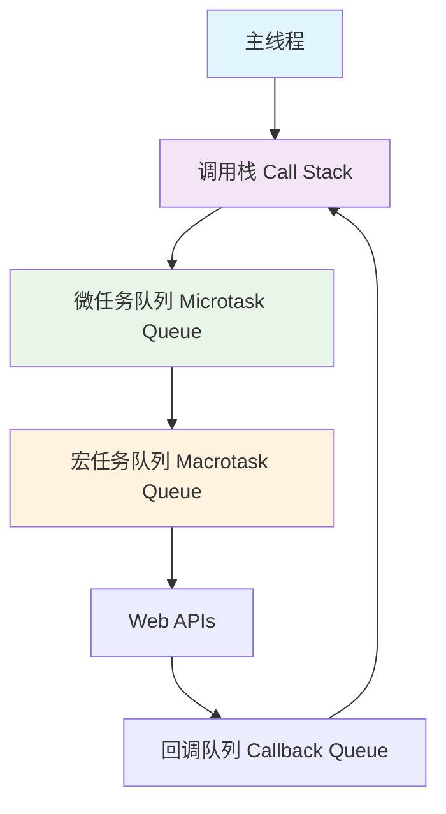
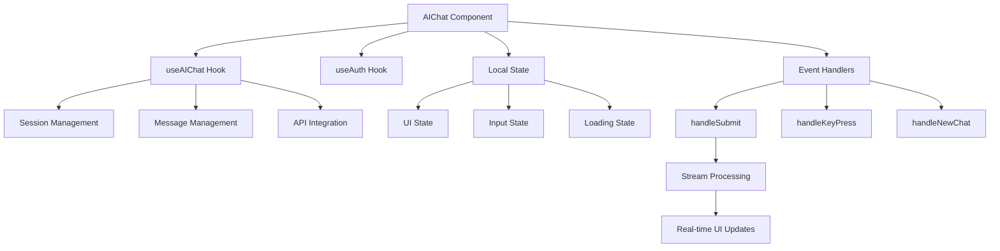
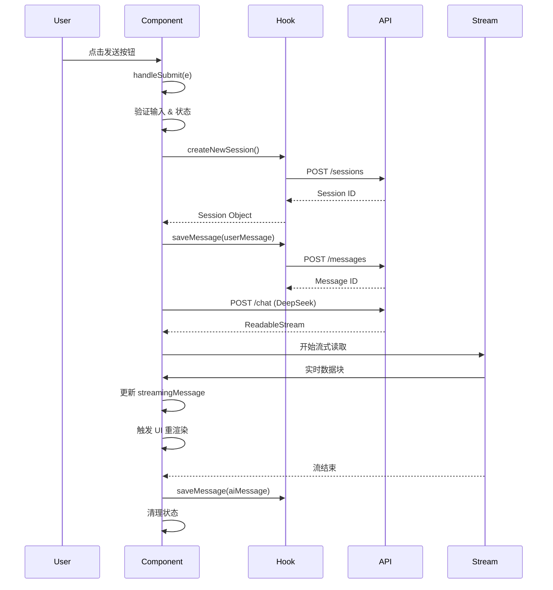
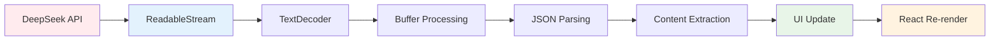
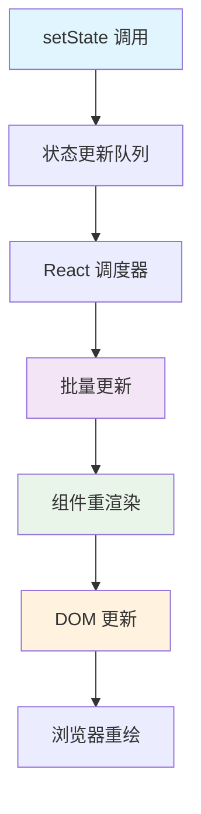

# AIChat 组件事件循环深度解析

## 📋 目录
- [1. 概述](#1-概述)
- [2. JavaScript 事件循环基础](#2-javascript-事件循环基础)
- [3. AIChat 组件架构分析](#3-aichat-组件架构分析)
- [4. 核心事件循环流程](#4-核心事件循环流程)
- [5. 流式响应处理机制](#5-流式响应处理机制)
- [6. React 状态更新循环](#6-react-状态更新循环)
- [7. 性能优化策略](#7-性能优化策略)
- [8. 面试要点总结](#8-面试要点总结)

---

## 1. 概述

### 1.1 项目背景
这是一个基于 Next.js + TypeScript 的 AI 聊天组件，实现了：
- **SSG + ISR** 静态生成
- **流式响应** 实时对话
- **会话管理** 多轮对话
- **Markdown 渲染** 富文本展示

### 1.2 技术栈
```
Frontend: React 18 + TypeScript + Next.js
UI: Framer Motion + SCSS
API: DeepSeek API (流式响应)
状态管理: React Hooks + Redux
```

### 1.3 核心挑战
- 如何处理复杂的异步事件流？
- 如何实现实时流式响应？
- 如何管理多层状态同步？
- 如何优化性能和用户体验？

---

## 2. JavaScript 事件循环基础

### 2.1 事件循环模型



### 2.2 执行优先级
```
1. 同步代码 (Call Stack)
2. 微任务 (Microtask Queue)
   - Promise.then/catch/finally
   - async/await
   - queueMicrotask()
3. 宏任务 (Macrotask Queue)
   - setTimeout/setInterval
   - setImmediate
   - requestAnimationFrame
   - I/O 操作
```

### 2.3 关键概念
- **Event Loop**: 持续检查调用栈是否为空
- **Call Stack**: 存储当前执行的函数调用
- **Task Queue**: 存储待执行的回调函数
- **Microtask**: 优先级高于宏任务，在下一个宏任务前执行

---

## 3. AIChat 组件架构分析

### 3.1 组件结构图



### 3.2 状态管理架构

```typescript
// 核心状态结构
interface AIChatState {
  // Hook 状态 (持久化)
  sessions: Session[];
  currentSession: Session | null;
  messages: Message[];
  
  // 本地状态 (临时)
  input: string;
  isLoading: boolean;
  streamingMessage: string;
  error: string | null;
}
```

---

## 4. 核心事件循环流程

### 4.1 用户交互事件循环



### 4.2 代码实现分析

```typescript
const handleSubmit = async (e: React.FormEvent) => {
    e.preventDefault(); // 1. 阻止默认行为
    
    if (!input.trim() || isLoading) return; // 2. 状态检查
    
    // 3. 创建会话 (微任务1)
    if (!currentSession) {
        const newSession = await createNewSession();
        if (!newSession) {
            setError('创建会话失败');
            return;
        }
    }
    
    // 4. 构造用户消息
    const userMessage: Message = {
        id: Date.now().toString(),
        content: input.trim(),
        type: 'user',
        timestamp: new Date(),
    };
    
    // 5. 保存用户消息 (微任务2)
    try {
        await saveMessage(userMessage);
    } catch (err) {
        console.error('保存用户消息失败:', err);
    }
    
    // 6. 更新本地状态
    setMessages(prev => [...prev, userMessage]);
    setInput('');
    setIsLoading(true);
    setError(null);
    setStreamingMessage('');
    
    // 7. 调用 AI API (微任务3)
    const response = await fetch(apiEndpoint, {
        method: 'POST',
        headers: {
            'Content-Type': 'application/json',
            'Authorization': `Bearer ${apiKey}`
        },
        body: JSON.stringify(responseBody)
    });
    
    // 8. 开始流式处理 (微任务4+)
    const reader = response.body?.getReader();
    const decoder = new TextDecoder();
    let buffer = '';
    let finalContent = '';
    
    while (true) {
        const { done, value } = await reader.read(); // 微任务循环
        if (done) break;
        
        // 处理流数据...
        buffer += decoder.decode(value, { stream: true });
        // 解析并更新 UI...
    }
};
```

### 4.3 事件循环时序分析

```
时间轴: 0ms → 10ms → 50ms → 100ms → 500ms → 1000ms
        ↓     ↓     ↓     ↓     ↓     ↓
事件:   点击   验证   创建   保存   调用   流式
       发送   输入   会话   消息   API   处理
       
微任务队列:
[验证输入] → [创建会话] → [保存消息] → [API调用] → [流处理1] → [流处理2] → ...
```

---

## 5. 流式响应处理机制

### 5.1 流式处理架构



### 5.2 核心流处理代码

```typescript
// 流式响应处理的核心逻辑
const reader = response.body?.getReader();
const decoder = new TextDecoder();
let buffer = '';
let finalContent = '';

while (true) {
    // 每次循环都是一个微任务
    const { done, value: contentValue } = await reader.read();
    
    if (done) {
        // 流结束，保存最终消息
        const finalMessage: Message = {
            id: (Date.now() + 1).toString(),
            content: finalContent,
            type: 'ai',
            timestamp: new Date(),
        };
        
        await saveMessage(finalMessage);
        setMessages(prev => [...prev, finalMessage]);
        setStreamingMessage('');
        break;
    }
    
    // 解码二进制数据
    buffer += decoder.decode(contentValue, { stream: true });
    const lines = buffer.split('\n');
    buffer = lines.pop() || '';
    
    // 处理每一行数据
    for (const line of lines) {
        if (line.startsWith('data: ')) {
            const data = line.slice(6);
            
            if (data === '[DONE]') {
                // 流结束标记
                break;
            }
            
            try {
                const parsed = JSON.parse(data);
                const content = parsed.choices[0]?.delta?.content || '';
                
                if (content) {
                    finalContent += content;
                    // 实时更新 UI
                    setStreamingMessage(finalContent);
                }
            } catch (e) {
                console.error('Error parsing stream data:', e);
            }
        }
    }
}
```

### 5.3 流式处理的事件循环特点

```typescript
// 特点1: 异步迭代器模式
while (true) {
    const { done, value } = await reader.read();
    // 每次 await 都会产生一个微任务
}

// 特点2: 实时状态更新
setStreamingMessage(finalContent);
// 每次调用都会触发 React 状态更新循环

// 特点3: 错误边界处理
try {
    const parsed = JSON.parse(data);
} catch (e) {
    console.error('Error parsing stream data:', e);
    // 错误不会中断流处理
}
```

---

## 6. React 状态更新循环

### 6.1 React 状态更新机制



### 6.2 状态同步机制

```typescript
// Hook 状态与本地状态同步
useEffect(() => {
    if (hookMessages.length > 0) {
        setMessages(hookMessages); // 触发本地状态更新
    } else {
        setMessages([]);
    }
}, [hookMessages]); // 依赖数组触发重新执行

// 错误状态同步
useEffect(() => {
    if (apiError) {
        setError(apiError); // 同步 API 错误到本地状态
    }
}, [apiError]);
```

### 6.3 状态更新优化

```typescript
// 批量状态更新
const handleSubmit = async (e: React.FormEvent) => {
    // 一次性更新多个状态，减少重渲染
    setMessages(prev => [...prev, userMessage]);
    setInput('');
    setIsLoading(true);
    setError(null);
    setStreamingMessage('');
};

// 函数式更新避免闭包陷阱
setMessages(prev => [...prev, finalMessage]);
```

---

## 7. 性能优化策略

### 7.1 事件循环优化

```typescript
// 1. 防抖处理
const handleKeyPress = (e: React.KeyboardEvent) => {
    if (e.key === 'Enter' && !e.shiftKey) {
        e.preventDefault();
        handleSubmit(e);
    }
};

// 2. 条件渲染
{isLoading && !streamingMessage && (
    <div className={styles.loadingDots}>
        {/* 只在需要时渲染 loading */}
    </div>
)}

// 3. 清理函数
useEffect(() => {
    const observer = new IntersectionObserver(/* ... */);
    return () => observer.disconnect(); // 防止内存泄漏
}, []);
```

### 7.2 内存管理

```typescript
// 1. 及时清理流资源
const reader = response.body?.getReader();
try {
    // 流处理逻辑
} finally {
    reader?.releaseLock(); // 释放流锁
}

// 2. 组件卸载时清理
useEffect(() => {
    return () => {
        // 清理定时器、事件监听器等
    };
}, []);
```

### 7.3 错误边界处理

```typescript
// 多层错误处理
try {
    await saveMessage(userMessage);
} catch (err) {
    console.error('保存用户消息失败:', err);
    // 继续执行，不阻塞主流程
}

try {
    const parsed = JSON.parse(data);
} catch (e) {
    console.error('Error parsing stream data:', e);
    // 解析错误不影响流处理
}
```

---

## 8. 面试要点总结

### 8.1 核心技术点

| 技术点 | 重要性 | 掌握程度要求 |
|--------|--------|--------------|
| JavaScript 事件循环 | ⭐⭐⭐⭐⭐ | 深入理解 |
| async/await 机制 | ⭐⭐⭐⭐⭐ | 熟练应用 |
| React 状态管理 | ⭐⭐⭐⭐ | 熟练掌握 |
| 流式数据处理 | ⭐⭐⭐⭐⭐ | 重点掌握 |
| 错误处理机制 | ⭐⭐⭐⭐ | 全面了解 |
| 性能优化策略 | ⭐⭐⭐⭐ | 实践应用 |

### 8.2 面试高频问题

#### Q1: 如何理解 JavaScript 事件循环？
**A:** 事件循环是 JavaScript 处理异步操作的核心机制，包含：
- 调用栈 (Call Stack)
- 微任务队列 (Microtask Queue)  
- 宏任务队列 (Macrotask Queue)
- Web APIs 和回调队列

#### Q2: async/await 在事件循环中的作用？
**A:** async/await 是 Promise 的语法糖：
- async 函数返回 Promise
- await 暂停函数执行，等待 Promise 解决
- 在微任务队列中处理

#### Q3: 如何处理流式响应？
**A:** 使用 ReadableStream API：
```typescript
const reader = response.body?.getReader();
while (true) {
    const { done, value } = await reader.read();
    if (done) break;
    // 处理流数据
}
```

#### Q4: React 状态更新的机制？
**A:** React 18 使用并发特性：
- 批量更新减少重渲染
- 优先级调度优化性能
- 自动批处理 (Automatic Batching)

#### Q5: 如何优化复杂组件的性能？
**A:** 多层面优化：
- 使用 useMemo/useCallback
- 实现懒加载
- 错误边界处理
- 及时清理资源

### 8.3 项目亮点总结

1. **复杂异步流程处理**: 展示了处理多层异步操作的成熟方案
2. **实时流式响应**: 实现了类似 ChatGPT 的实时对话体验
3. **状态管理优化**: Hook 与本地状态的完美结合
4. **错误处理完善**: 多层错误边界确保应用稳定性
5. **性能优化到位**: 懒加载、防抖、清理函数等优化策略

### 8.4 面试技巧

1. **准备项目演示**: 能够现场展示功能
2. **画图解释**: 用架构图解释技术实现
3. **代码讲解**: 能够逐行解释关键代码
4. **问题分析**: 能够分析潜在问题和解决方案
5. **扩展思考**: 能够讨论技术选型和优化方向

---

## 📚 参考资料

- [JavaScript 事件循环详解](https://developer.mozilla.org/en-US/docs/Web/JavaScript/EventLoop)
- [React 18 并发特性](https://react.dev/blog/2022/03/29/react-v18)
- [ReadableStream API](https://developer.mozilla.org/en-US/docs/Web/API/ReadableStream)
- [Next.js SSG/ISR](https://nextjs.org/docs/basic-features/data-fetching)

---

*这份文档涵盖了 AIChat 组件中事件循环的各个方面，是面试中的强力武器。建议结合实际代码进行练习，确保能够流畅地解释每个技术点。* 